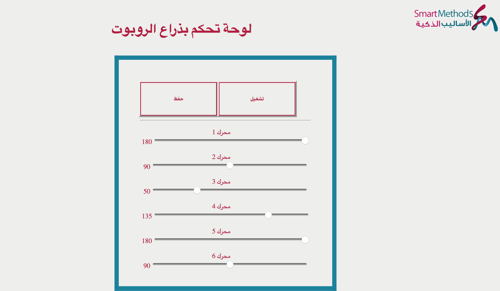

# Task1-RobotArmControl
This task is part of the summer training at the Smart Methods Company.
================================================================
This task contains 4 sub-tasks:
---------------------------------------------------------------
1. Designing the control interface of the arm.
2. Creating the database of the control arm.
3. Connecting the database with the control interface.
4. Creating PHP pages to link the database with the hardware.

----------------------------------------------------------------
This repository contains:
---------------------------------------------------------------
1. HTML page >> contains the control arm interface,
2. CSS page >>  contains the design of the control arm interface,
3. 2 pages of PHP>> **conn.php :** contains the code to connect the database with the interface, 
 **dataRetrieval.php :** contains the code to connect the database with the hardware that retrieves the data of the angles of the motors.
4. SQL : DB contains 2 tables (Motors and Start).

------------------------------
The task interface
---------------------------

------------------
هذه المهمة هي جزء من التدريب الصيفي في شركة الأساليب الذكية.
------------------------------------
تحتوي هذه المهمة على 4 مهام فرعية:
---------------
1. تصميم واجهة التحكم بالذراع. 
2. إنشاء قاعدة بيانات ذراع التحكم. 
3. ربط قاعدة البيانات بواجهة التحكم. 
4. إنشاء صفحات PHP لربط قاعدة البيانات بالأجهزة.

--------------------
يحتوي هذا المستودع على:
----------------------
1. HTML >  تحتوي على واجهة ذراع التحكم
2. CSS > تحتوي على تصميم واجهة ذراع التحكم
3. صفحتان PHP > **conn.php :** تحتوي على كود لربط قاعدة البيانات بالواجهة
**dataRetrieval.php :** تحتوي على كود لربط قاعدة البيانات بالذراع (الجهاز )الذي يسترد بيانات زوايا المحركات
4. SQL > قاعدة بيانات تحتوي على جدولين (محركات و التشغيل ).

